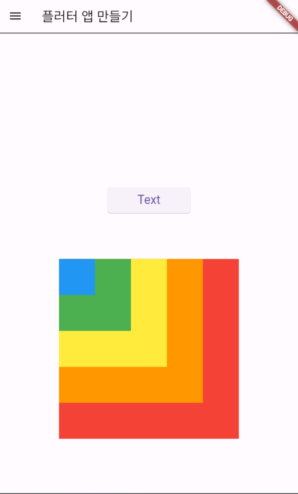

# AIFFEL Campus Online 7th Code Peer Review Templete

- 코더 : 김민기, 이선재, 한현종
- 리뷰어 : 최강훈

🔑 **PRT(Peer Review Template)**

- []  **1. 주어진 문제를 해결하는 완성된 코드가 제출되었나요?**
    - 문제에서 요구하는 최종 결과물이 첨부되었는지 확인
    - 문제를 해결하는 완성된 코드란 프로젝트 루브릭 3개 중 2개, 
    퀘스트 문제 요구조건 등을 지칭
        - 해당 조건을 만족하는 부분의 코드 및 결과물을 근거로 첨부
     
        - 

제일 어렵고 복잡했었던 버튼의 코드가 간결하게 잘 작성 되었습니다.

- []  **2. 전체 코드에서 가장 핵심적이거나 가장 복잡하고 이해하기 어려운 부분에 작성된 
주석 또는 doc string을 보고 해당 코드가 잘 이해되었나요?**
    - 해당 코드 블럭에 doc string/annotation이 달려 있는지 확인
    - 해당 코드가 무슨 기능을 하는지, 왜 그렇게 짜여진건지, 작동 메커니즘이 뭔지 기술.
    - 주석을 보고 코드 이해가 잘 되었는지 확인
        - 잘 작성되었다고 생각되는 부분을 근거로 첨부합니다.
        - 

        익스펜드에 대해서 이해가 잘 안갔는데, 같이 이야기를 나누면서 해결이 되었었다.


- []  **3. 에러가 난 부분을 디버깅하여 문제를 “해결한 기록을 남겼거나” 
”새로운 시도 또는 추가 실험을 수행”해봤나요?**
    - 문제 원인 및 해결 과정을 잘 기록하였는지 확인 또는
    - 문제에서 요구하는 조건에 더해 추가적으로 수행한 나만의 시도, 
    실험이 기록되어 있는지 확인
        - 잘 작성되었다고 생각되는 부분을 근거로 첨부합니다.
     
        - 

        AppBar의 디자인요소, 음영도 넣어보고 하시는 시도, 그리고 저희는 AppBar만 그냥 넣었었는데 선을 넣은것도 좋았습니다.


- []  **4. 회고를 잘 작성했나요?**
    - 주어진 문제를 해결하는 완성된 코드 내지 프로젝트 결과물에 대해
    배운점과 아쉬운점, 느낀점 등이 상세히 기록되어 있는지 확인


- []  **5. 코드가 간결하고 효율적인가요?**
    - 파이썬 스타일 가이드 (PEP8) 를 준수하였는지 확인
    - 코드 중복을 최소화하고 범용적으로 사용할 수 있도록 모듈화(함수화) 했는지
        - 잘 작성되었다고 생각되는 부분을 근거로 첨부합니다.
 
# 참고 링크 및 코드 개선
```
# 전체적인 코드는 구현이 잘 되어있고 신기한 방법을 많이 사용해서 성공한것이 잘한것같다.
#회고가 빠져서 조금 아쉬웠지만 코드자체는 되게 좋았다.
# 코드 리뷰 시 참고한 링크가 있다면 링크와 간략한 설명을 첨부합니다.
# 코드 리뷰를 통해 개선한 코드가 있다면 코드와 간략한 설명을 첨부합니다.
```


